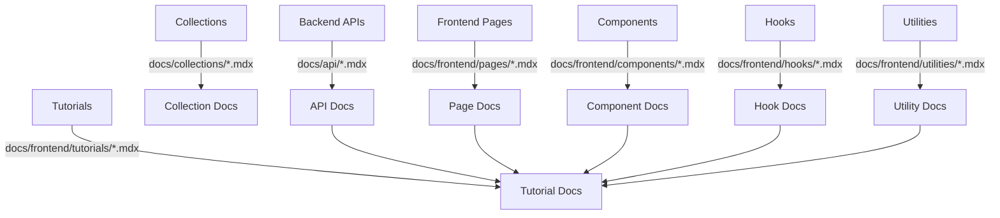

# Full Documentation & Tutorial Generation Plan

This plan covers the creation of comprehensive, beginner-friendly documentation for every backend and frontend module in the project, including real code examples, integration details, and step-by-step tutorials.

---

## 1. Backend Documentation

### 1.1 API Endpoints (`docs/api/`)
- `brands.mdx`
- `categories.mdx`
- `customers.mdx`
- `orders.mdx`
- `orders-id.mdx`
- `orders-track.mdx`
- `products.mdx` (exists)
- `products-slug.mdx`
- `products-verify-sku.mdx`
- `search.mdx`
- `users.mdx`
- `media.mdx`

**Each API doc includes:**
- Endpoint overview and purpose
- Request/response structure with real code
- Usage and integration with frontend
- Cross-links to collections, utilities, and frontend modules

### 1.2 Collections (`docs/collections/`)
- `Brands.mdx`
- `Categories.mdx`
- `Customers.mdx`
- `Media.mdx`
- `Orders.mdx`
- `Products.mdx` (exists)
- `Users.mdx`

**Each collection doc includes:**
- Schema explanation with code
- Hooks, access control, business logic
- DBML diagram references
- Integration points with APIs and frontend

---

## 2. Frontend Documentation

### 2.1 Pages (`docs/frontend/pages/`)
- `about.mdx`
- `brands.mdx`
- `checkout.mdx`
- `contact.mdx`
- `orders-track.mdx`
- `products.mdx`
- `products-slug.mdx`
- `products-verify.mdx`
- `not-found.mdx`
- `layout.mdx`
- `home.mdx`

### 2.2 Components (`docs/frontend/components/`)
- One .mdx per file in `src/components/` and subfolders (cart, ui, etc.)

### 2.3 Hooks (`docs/frontend/hooks/`)
- `use-cart.mdx`
- `use-mobile.mdx`
- `use-products.mdx`
- `use-toast.mdx`

### 2.4 Utilities (`docs/frontend/utilities/`)
- One .mdx per utility in `src/lib/` and `src/types/`

### 2.5 Tutorials (`docs/frontend/tutorials/`)
- `product-listing.mdx`
- `cart.mdx`
- `checkout.mdx`
- `authentication.mdx`
- `order-tracking.mdx`
- `brand-navigation.mdx`

**Each frontend doc includes:**
- What the module does
- Integration with backend
- Usage patterns, props, state
- Real code walkthroughs
- Cross-links to backend docs

---

## 3. Cross-linking & Beginner Focus

- All docs will cross-link related modules and reference real code.
- Explanations will avoid jargon and be beginner-friendly.

---

## 4. Mermaid Diagram

---

## 5. Implementation Steps

1. Inventory all backend and frontend modules.
2. Generate .mdx files for each, following the structure above.
3. Populate each file with real code, integration details, and beginner-friendly explanations.
4. Cross-link related docs and reference DBML diagrams where relevant.
5. Write step-by-step tutorials for common flows.

---

**This plan ensures every backend and frontend component is documented with real, accessible examples and integration details.**
